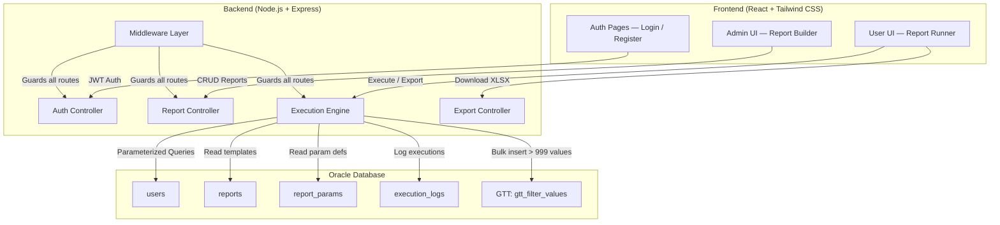
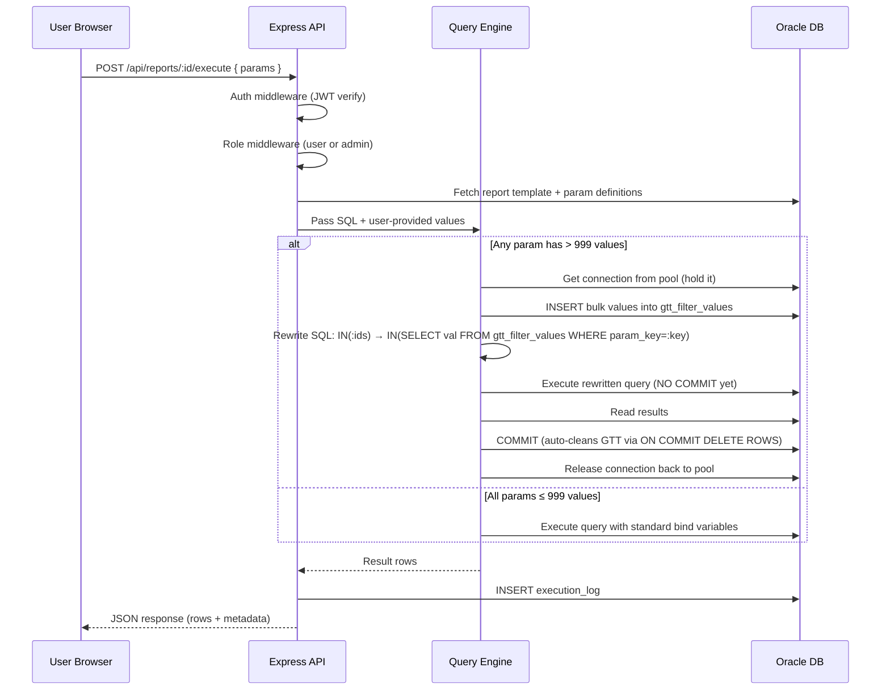
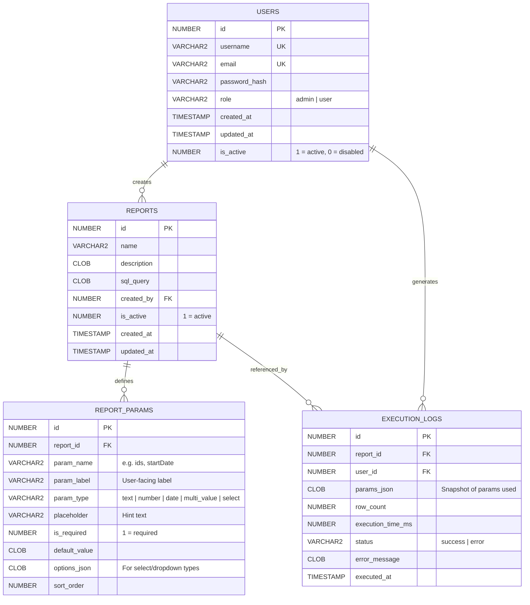
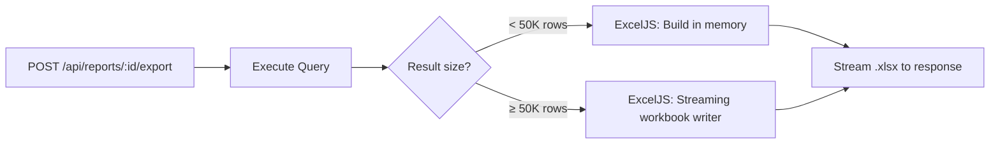

# Report Room — No-Code SQL Report Builder

## Overview

**Report Room** is a secure, no-code SQL report builder where admin users create report templates with parameterized SQL, and normal users execute those reports through a friendly UI — never seeing raw SQL. The system handles Oracle's 999-value IN-clause limit via session-scoped Global Temporary Tables, supports Excel export, and is safe for concurrent multi-user operation.

---

## 1. SYSTEM ARCHITECTURE

### 1.1 High-Level Architecture



### 1.2 Request Flow — Report Execution



### 1.3 Role-Based Access Design

| Capability | Admin | User |
|---|---|---|
| Login / Logout | ✅ | ✅ |
| Create / Edit / Delete reports | ✅ | ❌ |
| View report list | ✅ | ✅ |
| Execute reports | ✅ | ✅ |
| Export to Excel | ✅ | ✅ |
| View execution logs | ✅ | Own only |
| Manage users | ✅ | ❌ |

---

## 2. DATABASE DESIGN

### 2.1 Entity Relationship Diagram



### 2.2 DDL Statements

```sql
-- =====================================================
-- SEQUENCES
-- =====================================================
CREATE SEQUENCE seq_users START WITH 1 INCREMENT BY 1;
CREATE SEQUENCE seq_reports START WITH 1 INCREMENT BY 1;
CREATE SEQUENCE seq_report_params START WITH 1 INCREMENT BY 1;
CREATE SEQUENCE seq_execution_logs START WITH 1 INCREMENT BY 1;

-- =====================================================
-- USERS TABLE
-- =====================================================
CREATE TABLE users (
    id           NUMBER DEFAULT seq_users.NEXTVAL PRIMARY KEY,
    username     VARCHAR2(100) NOT NULL UNIQUE,
    email        VARCHAR2(255) NOT NULL UNIQUE,
    password_hash VARCHAR2(255) NOT NULL,
    role         VARCHAR2(20) DEFAULT 'user' CHECK (role IN ('admin', 'user')),
    is_active    NUMBER(1) DEFAULT 1,
    created_at   TIMESTAMP DEFAULT SYSTIMESTAMP,
    updated_at   TIMESTAMP DEFAULT SYSTIMESTAMP
);

-- =====================================================
-- REPORTS TABLE
-- =====================================================
CREATE TABLE reports (
    id           NUMBER DEFAULT seq_reports.NEXTVAL PRIMARY KEY,
    name         VARCHAR2(255) NOT NULL,
    description  CLOB,
    sql_query    CLOB NOT NULL,
    created_by   NUMBER NOT NULL REFERENCES users(id),
    is_active    NUMBER(1) DEFAULT 1,
    created_at   TIMESTAMP DEFAULT SYSTIMESTAMP,
    updated_at   TIMESTAMP DEFAULT SYSTIMESTAMP
);

CREATE INDEX idx_reports_created_by ON reports(created_by);

-- =====================================================
-- REPORT_PARAMS TABLE
-- =====================================================
CREATE TABLE report_params (
    id           NUMBER DEFAULT seq_report_params.NEXTVAL PRIMARY KEY,
    report_id    NUMBER NOT NULL REFERENCES reports(id) ON DELETE CASCADE,
    param_name   VARCHAR2(100) NOT NULL,
    param_label  VARCHAR2(255) NOT NULL,
    param_type   VARCHAR2(50) NOT NULL
                   CHECK (param_type IN ('text','number','date','multi_value','select')),
    placeholder  VARCHAR2(255),
    is_required  NUMBER(1) DEFAULT 1,
    default_value CLOB,
    options_json  CLOB,      -- JSON array for select/dropdown
    sort_order   NUMBER DEFAULT 0,
    CONSTRAINT uq_report_param UNIQUE (report_id, param_name)
);

CREATE INDEX idx_report_params_rid ON report_params(report_id);

-- =====================================================
-- EXECUTION_LOGS TABLE
-- =====================================================
CREATE TABLE execution_logs (
    id              NUMBER DEFAULT seq_execution_logs.NEXTVAL PRIMARY KEY,
    report_id       NUMBER NOT NULL REFERENCES reports(id),
    user_id         NUMBER NOT NULL REFERENCES users(id),
    params_json     CLOB,
    row_count       NUMBER,
    execution_time_ms NUMBER,
    status          VARCHAR2(20) CHECK (status IN ('success', 'error')),
    error_message   CLOB,
    executed_at     TIMESTAMP DEFAULT SYSTIMESTAMP
);

CREATE INDEX idx_exec_logs_report ON execution_logs(report_id);
CREATE INDEX idx_exec_logs_user   ON execution_logs(user_id);
CREATE INDEX idx_exec_logs_date   ON execution_logs(executed_at);

-- =====================================================
-- GLOBAL TEMPORARY TABLE — THE CORE GTT STRATEGY
-- =====================================================
CREATE GLOBAL TEMPORARY TABLE gtt_filter_values (
    param_key  VARCHAR2(100),   -- identifies which param this belongs to
    val        VARCHAR2(4000)   -- the actual filter value
) ON COMMIT DELETE ROWS;

CREATE INDEX idx_gtt_filter_val ON gtt_filter_values(param_key, val);
```

### 2.3 GTT Strategy — Detailed Explanation

> [!IMPORTANT]
> **Why a single GTT with `param_key` instead of multiple temp tables?**
> Creating/dropping tables at runtime is dangerous (DDL = implicit commit, permission issues, concurrency nightmares). Instead, we use **one pre-created GTT** with a `param_key` column to distinguish between different parameters. Since `ON COMMIT DELETE ROWS` guarantees session isolation, each connection's data is invisible to all other connections.

| Scenario | Strategy |
|---|---|
| Parameter `ids` has 500 values | Standard `WHERE col IN (:1, :2, ..., :500)` bind |
| Parameter `ids` has 2000 values | Bulk-insert 2000 rows into `gtt_filter_values` with `param_key = 'ids'`, rewrite SQL to `WHERE col IN (SELECT val FROM gtt_filter_values WHERE param_key = 'ids')` |
| Multiple params exceed 999 | Each uses a different `param_key` in the same GTT, e.g. `param_key = 'ids'` and `param_key = 'codes'` |
| Cleanup | `COMMIT` after query execution → `ON COMMIT DELETE ROWS` auto-cleans |
| Concurrency | GTT data is session-private by Oracle design → no cross-user leakage |

---

## 3. BACKEND ARCHITECTURE

### 3.1 Folder Structure

```
server/
├── src/
│   ├── config/
│   │   ├── database.js          # Oracle connection pool setup
│   │   ├── environment.js       # Env var loader + validation
│   │   └── cors.js              # CORS configuration
│   │
│   ├── middleware/
│   │   ├── auth.middleware.js    # JWT verification
│   │   ├── role.middleware.js    # Role-based access (admin/user)
│   │   ├── validate.middleware.js # Request body validation (Joi)
│   │   └── error.middleware.js  # Global error handler
│   │
│   ├── controllers/
│   │   ├── auth.controller.js   # Login, register, refresh token
│   │   ├── report.controller.js # CRUD for report templates
│   │   ├── execute.controller.js # Report execution
│   │   └── export.controller.js # Excel export
│   │
│   ├── services/
│   │   ├── auth.service.js      # Password hashing, JWT generation
│   │   ├── report.service.js    # Report CRUD business logic
│   │   ├── execute.service.js   # Query execution orchestration
│   │   ├── export.service.js    # XLSX generation
│   │   └── query-engine/
│   │       ├── index.js         # Main query engine entry point
│   │       ├── param-binder.js  # Standard parameter binding
│   │       ├── gtt-manager.js   # GTT bulk insert + SQL rewriting
│   │       ├── sql-validator.js # SQL safety checks (SELECT only)
│   │       └── sql-rewriter.js  # IN-clause transformation
│   │
│   ├── routes/
│   │   ├── auth.routes.js
│   │   ├── report.routes.js
│   │   ├── execute.routes.js
│   │   └── export.routes.js
│   │
│   ├── validators/
│   │   ├── auth.validator.js    # Joi schemas for auth
│   │   ├── report.validator.js  # Joi schemas for report CRUD
│   │   └── execute.validator.js # Joi schemas for execution params
│   │
│   ├── utils/
│   │   ├── logger.js            # Winston logger
│   │   ├── api-error.js         # Custom error class
│   │   ├── async-handler.js     # Express async wrapper
│   │   └── constants.js         # App constants (IN_CLAUSE_LIMIT = 999)
│   │
│   └── app.js                   # Express app setup
│
├── .env.example
├── package.json
└── server.js                    # Entry point — starts HTTP server
```

### 3.2 API Design

#### Auth Endpoints

| Method | Endpoint | Auth | Role | Description |
|--------|----------|------|------|-------------|
| `POST` | `/api/auth/register` | ❌ | — | Register new user (default role: `user`) |
| `POST` | `/api/auth/login` | ❌ | — | Login → returns JWT access + refresh tokens |
| `POST` | `/api/auth/refresh` | 🔑 | — | Refresh access token |
| `GET`  | `/api/auth/me` | 🔑 | — | Get current user profile |

#### Report Endpoints (Admin)

| Method | Endpoint | Auth | Role | Description |
|--------|----------|------|------|-------------|
| `POST` | `/api/reports` | 🔑 | admin | Create report template with params |
| `GET`  | `/api/reports` | 🔑 | any | List all active reports |
| `GET`  | `/api/reports/:id` | 🔑 | any | Get report details (admin sees SQL, user sees params only) |
| `PUT`  | `/api/reports/:id` | 🔑 | admin | Update report template |
| `DELETE` | `/api/reports/:id` | 🔑 | admin | Soft-delete report |

#### Execution Endpoints

| Method | Endpoint | Auth | Role | Description |
|--------|----------|------|------|-------------|
| `POST` | `/api/reports/:id/execute` | 🔑 | any | Execute report with user-provided params |
| `GET`  | `/api/reports/:id/logs` | 🔑 | any | Get execution history (admin: all, user: own) |

#### Export Endpoints

| Method | Endpoint | Auth | Role | Description |
|--------|----------|------|------|-------------|
| `POST` | `/api/reports/:id/export` | 🔑 | any | Execute + stream XLSX download |

### 3.3 Query Execution Engine — Core Logic

This is the most critical component. Here is the detailed algorithm:

```
┌─────────────────────────────────────────────────────────────────┐
│                    QUERY EXECUTION FLOW                         │
├─────────────────────────────────────────────────────────────────┤
│                                                                 │
│  1. VALIDATE                                                    │
│     ├─ Fetch report SQL + param definitions from DB             │
│     ├─ Validate user inputs against param definitions           │
│     └─ Run sql-validator: ensure SQL is SELECT only             │
│                                                                 │
│  2. CLASSIFY PARAMETERS                                         │
│     ├─ For each param:                                          │
│     │   ├─ If type = multi_value AND values.length > 999        │
│     │   │   → Mark as GTT_PARAM                                 │
│     │   ├─ If type = multi_value AND values.length ≤ 999        │
│     │   │   → Mark as INLINE_BIND (expand IN clause)            │
│     │   └─ Else (text, number, date)                            │
│     │       → Mark as SIMPLE_BIND                               │
│     └─ Determine: needsGTT = any GTT_PARAMs exist?             │
│                                                                 │
│  3A. STANDARD PATH (needsGTT = false)                           │
│     ├─ Get connection from pool                                 │
│     ├─ Build bind object with all SIMPLE + INLINE params        │
│     ├─ Expand IN(:param) → IN(:p1, :p2, ..., :pN)              │
│     ├─ Execute query with binds                                 │
│     ├─ Release connection                                       │
│     └─ Return rows                                              │
│                                                                 │
│  3B. GTT PATH (needsGTT = true)                                 │
│     ├─ Get connection from pool (HOLD IT — do NOT release)      │
│     ├─ For each GTT_PARAM:                                      │
│     │   ├─ Bulk INSERT into gtt_filter_values                   │
│     │   │   using connection.executeMany()                      │
│     │   │   with param_key = param_name                         │
│     │   └─ Rewrite SQL:                                         │
│     │       WHERE col IN (:param)                               │
│     │       → WHERE col IN (                                    │
│     │           SELECT val FROM gtt_filter_values               │
│     │           WHERE param_key = :_gtt_key_param               │
│     │         )                                                 │
│     ├─ Also handle INLINE + SIMPLE binds as normal              │
│     ├─ Execute the rewritten query                              │
│     ├─ COMMIT (triggers ON COMMIT DELETE ROWS cleanup)          │
│     ├─ Release connection back to pool                          │
│     └─ Return rows                                              │
│                                                                 │
│  4. LOG EXECUTION                                               │
│     └─ Insert into execution_logs (separate connection)         │
│                                                                 │
└─────────────────────────────────────────────────────────────────┘
```

#### 3.3.1 `gtt-manager.js` — Key Methods

```javascript
// Pseudocode for the GTT Manager

class GttManager {
  /**
   * Bulk insert values into GTT for a specific parameter.
   * Uses executeMany() for maximum performance.
   * 
   * @param {Connection} connection - Oracle connection (held open)
   * @param {string} paramKey - Parameter name (e.g. 'ids')
   * @param {string[]} values - Array of filter values
   */
  async insertValues(connection, paramKey, values) {
    const BATCH_SIZE = 5000;
    const sql = `INSERT INTO gtt_filter_values (param_key, val) VALUES (:pk, :v)`;
    
    for (let i = 0; i < values.length; i += BATCH_SIZE) {
      const batch = values.slice(i, i + BATCH_SIZE).map(v => ({
        pk: paramKey,
        v: String(v)
      }));
      
      await connection.executeMany(sql, batch, {
        autoCommit: false,  // CRITICAL: do not commit yet
        bindDefs: {
          pk: { type: oracledb.STRING, maxSize: 100 },
          v:  { type: oracledb.STRING, maxSize: 4000 }
        }
      });
    }
  }

  /**
   * Rewrite SQL to replace IN(:param) with GTT subquery.
   */
  rewriteSQL(sql, paramName) {
    const gttKeyBind = `_gtt_key_${paramName}`;
    const pattern = new RegExp(
      `IN\\s*\\(\\s*:${paramName}\\s*\\)`, 'gi'
    );
    return sql.replace(pattern,
      `IN (SELECT val FROM gtt_filter_values WHERE param_key = :${gttKeyBind})`
    );
  }
}
```

#### 3.3.2 `sql-validator.js` — Security Gate

```javascript
// Validates that the SQL is safe to execute

class SqlValidator {
  validate(sql) {
    const normalized = sql.trim().toUpperCase();
    
    // 1. Must start with SELECT or WITH (CTE)
    if (!normalized.startsWith('SELECT') && !normalized.startsWith('WITH')) {
      throw new ApiError(400, 'Only SELECT queries are allowed');
    }

    // 2. Block dangerous keywords
    const forbidden = [
      'INSERT', 'UPDATE', 'DELETE', 'DROP', 'ALTER', 'CREATE',
      'TRUNCATE', 'GRANT', 'REVOKE', 'EXEC', 'EXECUTE',
      'MERGE', 'CALL', 'DBMS_', 'UTL_'
    ];
    
    // Use word-boundary matching to avoid false positives
    // (e.g. "SELECTED" should not trigger "SELECT" block for INSERT)
    for (const keyword of forbidden) {
      const regex = new RegExp(`\\b${keyword}\\b`, 'i');
      // Check everywhere EXCEPT inside string literals
      if (regex.test(stripStringLiterals(sql))) {
        throw new ApiError(400, `Forbidden keyword detected: ${keyword}`);
      }
    }

    // 3. Block semicolons (prevent multiple statements)
    if (sql.includes(';')) {
      throw new ApiError(400, 'Multiple statements are not allowed');
    }

    return true;
  }
}
```

#### 3.3.3 Session & Locking Strategy

> [!NOTE]
> **Why we do NOT need explicit application-level locking:**
> Oracle GTTs with `ON COMMIT DELETE ROWS` provide inherent session isolation. Each database connection from the pool is a separate Oracle session. Data inserted by Connection A is **completely invisible** to Connection B. There is zero cross-session data leakage by Oracle's design.

**Our strategy:**

| Concern | Solution |
|---|---|
| **Data isolation** | `ON COMMIT DELETE ROWS` + Oracle session-private GTT data |
| **Connection safety** | Hold a single connection for the entire GTT→execute→commit cycle; never release mid-operation |
| **Pool exhaustion** | Set pool `max` connections; add execution timeout; add queue timeout for waiting requests |
| **Stale data prevention** | `COMMIT` after query execution triggers automatic GTT cleanup |
| **Error safety** | `ROLLBACK` in catch block also cleans GTT; connection released in `finally` block |
| **Multiple parameters** | Differentiated by `param_key` column in the same GTT |

```javascript
// Connection lifecycle for GTT operations
async function executeWithGTT(report, params) {
  let connection;
  try {
    connection = await pool.getConnection();
    
    // Insert GTT values (no commit)
    for (const gttParam of gttParams) {
      await gttManager.insertValues(connection, gttParam.name, gttParam.values);
    }
    
    // Execute rewritten query
    const result = await connection.execute(rewrittenSQL, binds, {
      outFormat: oracledb.OUT_FORMAT_OBJECT,
      fetchArraySize: 1000
    });
    
    // Commit → cleans GTT automatically
    await connection.commit();
    
    return result.rows;
  } catch (err) {
    if (connection) await connection.rollback(); // Also cleans GTT
    throw err;
  } finally {
    if (connection) await connection.close(); // Returns to pool
  }
}
```

### 3.4 Oracle Connection Pool Configuration

```javascript
// config/database.js
const oracledb = require('oracledb');

async function initializePool() {
  await oracledb.createPool({
    user: process.env.ORACLE_USER,
    password: process.env.ORACLE_PASSWORD,
    connectString: process.env.ORACLE_CONNECT_STRING,
    
    // Pool sizing
    poolMin: 4,
    poolMax: 20,
    poolIncrement: 2,
    
    // Timeouts
    poolTimeout: 60,           // Idle connection timeout (seconds)
    queueTimeout: 30000,       // Max wait for connection (ms)
    
    // Statement caching for performance
    stmtCacheSize: 30,
    
    // Enable prefetching for large result sets
    prefetchRows: 1000,
  });
}
```

---

## 4. FRONTEND ARCHITECTURE

### 4.1 Folder Structure

```
client/
├── public/
│   └── favicon.ico
├── src/
│   ├── assets/
│   │   └── logo.svg
│   │
│   ├── components/
│   │   ├── ui/                      # Reusable primitives
│   │   │   ├── Button.jsx
│   │   │   ├── Input.jsx
│   │   │   ├── Select.jsx
│   │   │   ├── DatePicker.jsx
│   │   │   ├── TextArea.jsx
│   │   │   ├── MultiValueInput.jsx  # Tag-style multi-value input
│   │   │   ├── Modal.jsx
│   │   │   ├── Table.jsx            # Sortable data table
│   │   │   ├── Spinner.jsx
│   │   │   └── Toast.jsx
│   │   │
│   │   ├── layout/
│   │   │   ├── AppLayout.jsx        # Sidebar + header + content
│   │   │   ├── Sidebar.jsx
│   │   │   └── Header.jsx
│   │   │
│   │   ├── auth/
│   │   │   ├── LoginForm.jsx
│   │   │   └── ProtectedRoute.jsx
│   │   │
│   │   ├── reports/
│   │   │   ├── ReportList.jsx       # Card grid of available reports
│   │   │   ├── ReportCard.jsx       # Single report card
│   │   │   ├── DynamicParamForm.jsx # ⭐ Dynamic form from param defs
│   │   │   ├── ResultsTable.jsx     # Query results display
│   │   │   └── ExecutionHistory.jsx # Past runs
│   │   │
│   │   └── admin/
│   │       ├── ReportBuilder.jsx    # SQL + params creation form
│   │       ├── ParamEditor.jsx      # Add/edit parameters
│   │       ├── SqlEditor.jsx        # SQL textarea with syntax hints
│   │       └── UserManager.jsx      # Manage users (optional)
│   │
│   ├── pages/
│   │   ├── LoginPage.jsx
│   │   ├── DashboardPage.jsx        # Report list for users
│   │   ├── ReportRunnerPage.jsx     # Execute a specific report
│   │   ├── AdminReportsPage.jsx     # Admin: manage reports
│   │   ├── AdminReportFormPage.jsx  # Admin: create/edit report
│   │   └── NotFoundPage.jsx
│   │
│   ├── services/
│   │   ├── api.js                   # Axios instance with interceptors
│   │   ├── auth.service.js          # Login, register, refresh
│   │   ├── report.service.js        # CRUD report templates
│   │   └── execute.service.js       # Execute + export
│   │
│   ├── hooks/
│   │   ├── useAuth.js               # Auth context hook
│   │   ├── useReports.js            # Fetch reports
│   │   └── useExecution.js          # Execute + loading state
│   │
│   ├── context/
│   │   └── AuthContext.jsx          # JWT + user state
│   │
│   ├── utils/
│   │   ├── constants.js
│   │   └── formatters.js           # Date, number formatters
│   │
│   ├── App.jsx
│   ├── index.css                    # Tailwind directives + design tokens
│   └── main.jsx
│
├── tailwind.config.js
├── postcss.config.js
├── vite.config.js
├── index.html
└── package.json
```

### 4.2 Dynamic Parameter Form — The Core UX Component

The `DynamicParamForm` component is the heart of the user experience. It reads param definitions from the API and renders the appropriate input control for each parameter:

```
┌──────────────────────────────────────────────────────┐
│ Report: Monthly Sales Summary                        │
├──────────────────────────────────────────────────────┤
│                                                      │
│  Region IDs *                                        │
│  ┌──────────────────────────────────────────────┐    │
│  │ [101] [205] [309] [412] + Add more...        │    │
│  └──────────────────────────────────────────────┘    │
│  Paste multiple values (comma or newline separated)  │
│                                                      │
│  Start Date *          End Date *                    │
│  ┌──────────────┐      ┌──────────────┐             │
│  │ 2026-01-01   │      │ 2026-03-31   │             │
│  └──────────────┘      └──────────────┘             │
│                                                      │
│  Department                                          │
│  ┌──────────────────────────────────────────────┐    │
│  │ ▼ Sales                                      │    │
│  └──────────────────────────────────────────────┘    │
│                                                      │
│  ┌─────────────┐  ┌──────────────────┐               │
│  │ ▶ Run Report│  │ 📥 Export Excel  │               │
│  └─────────────┘  └──────────────────┘               │
│                                                      │
└──────────────────────────────────────────────────────┘
```

**Component Map Pattern:**

```javascript
const PARAM_COMPONENT_MAP = {
  text:        TextInput,
  number:      NumberInput,
  date:        DatePicker,
  multi_value: MultiValueInput,  // Tag-style with paste support
  select:      SelectDropdown,
};

function DynamicParamForm({ params, onSubmit }) {
  return params
    .sort((a, b) => a.sort_order - b.sort_order)
    .map(param => {
      const Component = PARAM_COMPONENT_MAP[param.param_type];
      return <Component key={param.id} {...param} />;
    });
}
```

### 4.3 Key UI Screens

| Screen | URL | Description |
|---|---|---|
| Login | `/login` | JWT login with remember-me |
| Dashboard | `/` | Card grid of available reports, search + filter |
| Run Report | `/reports/:id/run` | Dynamic param form → results table → export |
| Admin: Reports | `/admin/reports` | Table of all reports with CRUD actions |
| Admin: Create | `/admin/reports/new` | SQL editor + param builder |
| Admin: Edit | `/admin/reports/:id/edit` | Modify existing report |

---

## 5. EXCEL EXPORT MODULE

### 5.1 Architecture



### 5.2 Implementation Details

- **Library:** `exceljs` — supports both in-memory and streaming workbook creation
- **Streaming:** For large datasets (50K+ rows), use `ExcelJS.stream.xlsx.WorkbookWriter` which pipes directly to the HTTP response, never holding the entire workbook in memory
- **Headers:** Auto-generate column headers from query result metadata (`result.metaData`)
- **Formatting:** Auto-width columns, freeze header row, apply header styling
- **Filename:** `{report_name}_{YYYY-MM-DD_HHmmss}.xlsx`

```javascript
// Streaming export pseudocode
async function streamExport(res, reportName, result) {
  res.setHeader('Content-Type', 
    'application/vnd.openxmlformats-officedocument.spreadsheetml.sheet');
  res.setHeader('Content-Disposition', 
    `attachment; filename="${reportName}_${timestamp()}.xlsx"`);

  const workbook = new ExcelJS.stream.xlsx.WorkbookWriter({ stream: res });
  const sheet = workbook.addWorksheet('Report');

  // Add header row from metadata
  sheet.columns = result.metaData.map(col => ({
    header: col.name,
    key: col.name,
    width: Math.max(col.name.length + 4, 15)
  }));

  // Style header
  sheet.getRow(1).font = { bold: true };
  sheet.getRow(1).fill = { type: 'pattern', pattern: 'solid', fgColor: { argb: 'FF1E293B' }};
  sheet.getRow(1).font = { bold: true, color: { argb: 'FFFFFFFF' }};

  // Stream rows
  for (const row of result.rows) {
    sheet.addRow(row).commit();
  }

  await workbook.commit(); // Flushes and ends the stream
}
```

### 5.3 Performance Considerations

| Factor | Strategy |
|---|---|
| Memory | Streaming writer for 50K+ rows; never buffer entire workbook |
| Timeout | Set longer timeout for export endpoints (5 minutes vs 30s default) |
| Oracle fetch | Use `fetchArraySize: 1000` + result set streaming for huge queries |
| Concurrency | Limit concurrent exports via semaphore (max 5 simultaneous) |
| Client UX | Show progress indicator; disable export button during download |

---

## 6. STEP-BY-STEP IMPLEMENTATION PLAN

### Phase 1: Project Setup & Database (Day 1–2)

1. Initialize monorepo structure (`server/` + `client/`)
2. Set up Express project with TypeScript-ready structure (or plain JS)
3. Set up Vite + React + Tailwind CSS project
4. Install Oracle Instant Client + `oracledb` driver
5. Create all database tables, sequences, indexes
6. Create the GTT (`gtt_filter_values`)
7. Set up connection pool configuration
8. Seed an admin user
9. Verify database connectivity

### Phase 2: Authentication System (Day 2–3)

1. Implement password hashing (bcrypt)
2. Build JWT token generation (access + refresh)
3. Create auth controller (register, login, refresh, me)
4. Build auth middleware (verify JWT on every request)
5. Build role middleware (`requireAdmin`, `requireAny`)
6. Create login page UI
7. Implement auth context + protected routes in React
8. Wire up Axios interceptors for token refresh

### Phase 3: Report Management — Admin (Day 3–5)

1. Build report CRUD service (create, read, update, soft-delete)
2. Build report params service (add/update/delete params for a report)
3. Create report routes + controller
4. Add Joi validation schemas
5. Build Admin Reports page (list all reports)
6. Build Report Builder form (SQL editor + param builder)
7. Implement SQL syntax highlighting (optional: CodeMirror)
8. Test full CRUD flow

### Phase 4: Report Execution — User (Day 5–8)

1. Build the query execution engine (`query-engine/index.js`)
2. Implement SQL validator (`sql-validator.js`)
3. Implement standard parameter binder (`param-binder.js`)
4. Implement IN-clause expansion for ≤999 values
5. Implement GTT manager (`gtt-manager.js`) — bulk insert + SQL rewriting
6. Build execution controller + routes
7. Build User Dashboard page (report list cards)
8. Build `DynamicParamForm` component
9. Build `MultiValueInput` component (tag input with paste support)
10. Build `ResultsTable` component (sortable, paginated)
11. Wire up execution flow end-to-end
12. Add execution logging

### Phase 5: Excel Export (Day 8–9)

1. Install + configure `exceljs`
2. Build export service (in-memory + streaming paths)
3. Build export controller + route
4. Add export button to Report Runner UI
5. Handle download via Axios blob response
6. Test with small and large datasets

### Phase 6: Temp Table & Scaling Optimizations (Day 9–10)

1. Load-test GTT path with 5000+ value inputs
2. Tune `executeMany` batch size
3. Add connection pool monitoring / health endpoint
4. Add query execution timeout (`CALL DBMS_SESSION.SET_TIMEOUT`)
5. Add concurrent export limiting (semaphore)
6. Test concurrent users hitting GTT simultaneously
7. Verify GTT cleanup under error conditions

### Phase 7: Security Hardening (Day 10–11)

1. Add rate limiting (`express-rate-limit`)
2. Add Helmet.js for HTTP security headers
3. Add CORS whitelist configuration
4. Harden SQL validator (test edge cases)
5. Add request size limits for multi-value inputs (max 50K values)
6. Add input sanitization
7. Security audit: verify no SQL injection vectors
8. Add audit logging for admin actions

---

## 7. DETAILED TODO LIST

> **Status: ALL TASKS COMPLETE ✅** — 81/81 tasks finished.

### Backend Tasks (48/48 ✅)

#### Setup & Config (B-01 to B-09) ✅
- [x] `B-01` Initialize `server/` with `npm init`, install Express, cors, dotenv
- [x] `B-02` Install `oracledb`, configure Oracle Instant Client
- [x] `B-03` Create `config/database.js` — connection pool with all options
- [x] `B-04` Create `config/environment.js` — env var validation
- [x] `B-05` Create `.env.example` with all required variables
- [x] `B-06` Create `utils/logger.js` (Winston) + `utils/api-error.js` + `utils/async-handler.js`
- [x] `B-07` Create `middleware/error.middleware.js` — global error handler
- [x] `B-08` Create `app.js` — Express app with middleware chain
- [x] `B-09` Create `server.js` — HTTP server entry point

#### Database & DDL (B-10 to B-13) ✅
- [x] `B-10` Write DDL script for all tables + sequences + indexes
- [x] `B-11` Write DDL for `gtt_filter_values` GTT
- [x] `B-12` Write seed script for admin user
- [x] `B-13` Test database connectivity + pool behavior

#### Authentication (B-14 to B-20) ✅
- [x] `B-14` Create `services/auth.service.js` — hashPassword, comparePassword, generateTokens
- [x] `B-15` Create `controllers/auth.controller.js` — login, refresh, me
- [x] `B-16` Create `middleware/auth.middleware.js` — JWT verification
- [x] `B-17` Create `middleware/role.middleware.js` — role checking
- [x] `B-18` Create `routes/auth.routes.js`
- [x] `B-19` Create `validators/auth.validator.js` — Joi schemas
- [x] `B-20` Test complete auth flow

#### Report CRUD (B-21 to B-25) ✅
- [x] `B-21` Create `services/report.service.js` — CRUD operations
- [x] `B-22` Create `controllers/report.controller.js`
- [x] `B-23` Create `routes/report.routes.js` with role guards
- [x] `B-24` Create `validators/report.validator.js` — Joi schemas for create/update
- [x] `B-25` Test report CRUD endpoints

#### Query Execution Engine (B-26 to B-37) ✅
- [x] `B-26` Create `services/query-engine/sql-validator.js` — SELECT-only enforcement
- [x] `B-27` Create `services/query-engine/param-binder.js` — standard binding + IN expansion
- [x] `B-28` Create `services/query-engine/gtt-manager.js` — bulk insert + SQL rewriting
- [x] `B-29` Create `services/query-engine/sql-rewriter.js` — IN clause → GTT subquery
- [x] `B-30` Create `services/query-engine/index.js` — orchestrate full execution flow
- [x] `B-31` Create `services/execute.service.js` — execution orchestration + logging
- [x] `B-32` Create `controllers/execute.controller.js`
- [x] `B-33` Create `routes/execute.routes.js`
- [x] `B-34` Create `validators/execute.validator.js`
- [x] `B-35` Test execution with ≤999 values
- [x] `B-36` Test execution with >999 values (GTT path)
- [x] `B-37` Test execution with multiple params all >999

#### Excel Export (B-38 to B-42) ✅
- [x] `B-38` Install `exceljs`, create `services/export.service.js`
- [x] `B-39` Create `controllers/export.controller.js` — streaming response
- [x] `B-40` Create `routes/export.routes.js`
- [x] `B-41` Test small dataset export (<1K rows)
- [x] `B-42` Test large dataset export (>50K rows) with streaming

#### Security & Hardening (B-43 to B-48) ✅
- [x] `B-43` Add `helmet` + `express-rate-limit` middleware
- [x] `B-44` Add request body size limits
- [x] `B-45` Add query execution timeout handling
- [x] `B-46` Add concurrent export semaphore
- [x] `B-47` Security test: attempt SQL injection vectors
- [x] `B-48` Add health check endpoint (`GET /api/health` — pool stats)

#### Role-Based Access (D-01 to D-06, S-01 to S-08, C-01 to C-09, W-01 to W-04) ✅
- [x] `D-01` Create `04_create_roles_tables.sql` — sequences, 5 tables, indexes
- [x] `D-02` Create `04_seed_roles.sql` — seed default roles and categories
- [x] `D-03` Add `is_admin` column to roles table
- [x] `D-04` Update `seed-admin.js` — assign admin user to Admin role
- [x] `D-05` Update `03_drop_all.sql` — add DROP for new tables
- [x] `D-06` Update `test-db.js` — check role/category tables
- [x] `S-01` Create `role.service.js` — full CRUD, category assignment
- [x] `S-02` Create `category.service.js` — full CRUD, cascade delete
- [x] `S-03` Create `user-admin.service.js` — user CRUD, role assignment
- [x] `S-04` Create `access.service.js` — `canAccessReport`, `getUserAccessibleCategoryIds`
- [x] `S-05` Modify `auth.service.js` — `findUserById` JOINs roles, returns `roles` array
- [x] `S-06` Modify `report.service.js` — filter by accessible categories, category assignment
- [x] `S-07` Modify `execute.service.js` — access check before execution
- [x] `S-08` Modify `export.service.js` — access check before export
- [x] `C-01` Create `role.controller.js`
- [x] `C-02` Create `category.controller.js`
- [x] `C-03` Create `user-admin.controller.js`
- [x] `C-04` Create `role.validator.js`
- [x] `C-05` Create `category.validator.js`
- [x] `C-06` Create `user-admin.validator.js`
- [x] `C-07` Create `role.routes.js`
- [x] `C-08` Create `category.routes.js`
- [x] `C-09` Create `user-admin.routes.js`
- [x] `W-01` Remove `POST /register` from auth routes
- [x] `W-02` Update `auth.middleware.js` — `req.user.roles` array
- [x] `W-03` Update `role.middleware.js` — `requireAdmin` checks `roles` array
- [x] `W-04` Wire up admin routes in `app.js`

---

### Frontend Tasks (33/33 ✅)

#### Setup & Design System (F-01 to F-04) ✅
- [x] `F-01` Initialize Vite + React project
- [x] `F-02` Install + configure Tailwind CSS v3
- [x] `F-03` Create design tokens in `index.css` (colors, fonts, animations)
- [x] `F-04` Install dependencies: `axios`, `react-router-dom`, `react-hot-toast`

#### UI Components (F-05 to F-10) ✅
- [x] `F-05` Build `Button`, `Input`, `Select`, `TextArea` components
- [x] `F-06` Build `Modal`, `Spinner`, `Toast` components
- [x] `F-07` Build `Table` component with sorting
- [x] `F-08` Build `DatePicker` component (react-datepicker)
- [x] `F-09` Build `MultiValueInput` — tag-style with paste support
- [x] `F-10` Build `AppLayout`, `Sidebar`, `Header` components

#### Auth & Routing (F-11 to F-16) ✅
- [x] `F-11` Create `api/apiClient.js` — Axios instance + interceptors
- [x] `F-12` Create `api/adminApi.js` — admin API client
- [x] `F-13` Create `context/AuthContext.jsx` — JWT state management
- [x] `F-14` Create `LoginPage.jsx` with form
- [x] `F-15` Create `ProtectedRoute.jsx` + role-based routing
- [x] `F-16` Set up `App.jsx` with router + layout

#### User Pages (F-17 to F-23) ✅
- [x] `F-17` Create `DashboardPage.jsx` — report cards grid with search
- [x] `F-18` Create `ReportCard.jsx` component
- [x] `F-19` Create `DynamicParamForm.jsx` — schema-driven form generation
- [x] `F-20` Create `ReportDetailPage.jsx` — params + results + export
- [x] `F-21` Create `ResultsTable.jsx` — paginated results display
- [x] `F-22` Implement Excel download handler
- [x] `F-23` Create `ExecutionHistory.jsx` — past runs

#### Admin Pages (F-24 to F-28) ✅
- [x] `F-24` Create `ManageReportsPage.jsx` — reports table with actions
- [x] `F-25` Create `ReportEditorPage.jsx` — create/edit form
- [x] `F-26` Create `SqlEditor.jsx` — textarea with param highlighting
- [x] `F-27` Create `ParamEditor.jsx` — add/remove/reorder params
- [x] `F-28` Wire up admin CRUD flow end-to-end

#### Role-Based Access Pages (A-01 to A-10) ✅
- [x] `A-01` Create `ManageRolesPage.jsx` — table with user/category counts
- [x] `A-02` Create `ManageCategoriesPage.jsx` — table with report/role counts
- [x] `A-03` Create `RoleEditorPage.jsx` — edit role with category assignment
- [x] `A-04` Create `ManageUsersPage.jsx` — table with role badges
- [x] `A-05` Create `UserEditorPage.jsx` — create user with role assignment
- [x] `A-06` Create `RoleCheckboxGroup.jsx` — reusable role assignment
- [x] `A-07` Create `CategoryCheckboxGroup.jsx` — reusable category assignment
- [x] `A-08` Create `api/adminApi.js` — admin API client
- [x] `A-09` Add admin routes to `AppRouter.jsx`
- [x] `A-10` Update `Sidebar.jsx` — add Roles, Categories, Users links

#### Polish (F-29 to F-33) ✅
- [x] `F-29` Add loading states + skeleton screens
- [x] `F-30` Add error boundaries + empty states
- [x] `F-31` Add toast notifications for all actions
- [x] `F-32` Responsive design pass (mobile sidebar, table scroll)
- [x] `F-33` Dark mode toggle with system preference detection

#### Access Control (AC-01 to AC-04) ✅
- [x] `AC-01` `ReportsPage.jsx` — backend filters by accessible categories
- [x] `AC-02` `ReportDetailPage.jsx` — "Access Denied" for 403
- [x] `AC-03` `ReportEditorPage.jsx` — category assignment checkboxes
- [x] `AC-04` `ProtectedRoute.jsx` — checks `roles` array

---

## 8. EDGE CASES & HANDLING

| Edge Case | Detection | Handling |
|---|---|---|
| **Empty input array** | `values.length === 0` for a required `multi_value` param | Return 400: "Parameter X is required" |
| **Single value in multi_value** | `values.length === 1` | Use `WHERE col = :param` instead of `IN` for efficiency |
| **Exactly 999 values** | `values.length === 999` | Use standard IN-clause binding (boundary condition) |
| **1000+ values** | `values.length > 999` | GTT path — bulk insert + subquery rewrite |
| **50,000+ values** | `values.length > 50000` | Return 400: "Maximum 50,000 values allowed per parameter" |
| **Concurrent GTT usage** | Multiple users executing reports simultaneously | Oracle GTT session isolation handles this automatically |
| **Connection pool exhaustion** | All connections busy | `queueTimeout` returns 503; log warning for ops team |
| **Invalid SQL in template** | Admin enters malformed SQL | SQL validator catches on create; if it passes validation but fails at runtime, catch Oracle error and return 500 with sanitized message |
| **SQL injection attempt** | User crafts malicious param values | All values are parameter-bound; GTT values are also bound via `executeMany` — never string-concatenated |
| **Query timeout** | Report query runs >60 seconds | `connection.callTimeout = 60000`; catch timeout error, return 408 |
| **Huge result set** | Query returns 1M+ rows | For UI: limit to first 10K rows with warning; for export: stream all rows |
| **GTT cleanup failure** | App crashes between insert and commit | Oracle session termination auto-cleans GTT; pool health check removes dead connections |
| **Duplicate param names** | Admin creates two params with same name | `UNIQUE(report_id, param_name)` constraint prevents this |
| **Date format mismatch** | User enters date in wrong format | Validate format on frontend + backend before binding; use ISO 8601 |
| **Report deleted during execution** | Race condition | Fetch report + execute in same transaction; check `is_active` flag |
| **Non-numeric values for NUMBER param** | User enters "abc" for a number field | Joi validation rejects; frontend input type prevents |

---

## 9. BONUS FEATURES (Optional — Post-MVP)

### 9.1 Saved Report Runs
- Users can save a set of parameters as a "Saved Run" for quick re-execution
- Table: `saved_runs (id, report_id, user_id, params_json, name, created_at)`

### 9.2 Query Result Caching
- Cache execution results using report_id + param hash as key
- Use Node.js `node-cache` or Redis
- TTL configurable per report (e.g. 5 min for real-time, 1 hour for static data)
- Cache invalidation on report SQL edit

### 9.3 Server-Side Pagination
- For queries returning large result sets, implement `OFFSET/FETCH` pagination
- API: `?page=1&pageSize=100`
- Requires wrapping user SQL: `SELECT * FROM ({user_sql}) OFFSET :off ROWS FETCH NEXT :ps ROWS ONLY`

### 9.4 Column Selection & Reordering
- After first execution, show column checkboxes
- Users can hide/show/reorder columns before export

### 9.5 Audit Logs
- Track all admin actions (create/edit/delete report, create user)
- Table: `audit_logs (id, user_id, action, entity_type, entity_id, details_json, created_at)`

### 9.6 Report Scheduling (Advanced)
- Schedule reports to run periodically (cron)
- Email results as XLSX attachment
- Uses `node-cron` + `nodemailer`

### 9.7 Report Sharing & Permissions
- Share specific reports with specific users/groups
- Table: `report_permissions (report_id, user_id, can_execute, can_export)`

---

## User Review Required

> [!IMPORTANT]
> **Technology Confirmation:** The plan uses plain JavaScript (not TypeScript) for the backend. Should we use TypeScript instead for better type safety?

> [!IMPORTANT]
> **Tailwind Version:** The user requested Tailwind CSS. Please confirm: **Tailwind CSS v3** (stable, class-based) or **v4** (new CSS-first config)? Plan assumes v3.

> [!WARNING]
> **Oracle Instant Client:** The backend requires Oracle Instant Client to be installed on the development/deployment machine. This is a system-level dependency that cannot be installed via npm. Please confirm you have it installed or need instructions.

> [!IMPORTANT]
> **Authentication Scope:** The plan includes basic JWT auth with register/login. Should we add:
> - Email verification on registration?
> - Password reset flow?
> - Admin-only user creation (no self-registration)?

## Open Questions

1. **Database connection details:** Do you already have an Oracle database instance set up, or do we need to include Docker setup for Oracle XE?
2. **User registration:** Should any user be able to register, or should only admins create user accounts?
3. **Report visibility:** Should all users see all active reports, or should there be report-level permissions?
4. **Max concurrent users:** Expected number of simultaneous users? This affects connection pool sizing.
5. **Deployment target:** Where will this be deployed? (Docker, bare metal, cloud VM?) This affects the project structure.

## Verification Plan

### Automated Tests
- Unit tests for `sql-validator.js` — test all forbidden keywords, edge cases
- Unit tests for `param-binder.js` — binding expansion logic
- Unit tests for `gtt-manager.js` — SQL rewriting
- Integration tests for full execution flow (≤999 and >999 paths)
- API endpoint tests using supertest

### Manual Verification
- Browser testing: login → create report → execute → export flow
- Load testing: 10 concurrent users executing GTT-path reports
- Security testing: SQL injection attempts via parameter values
- Export testing: verify XLSX opens correctly in Excel with proper formatting
